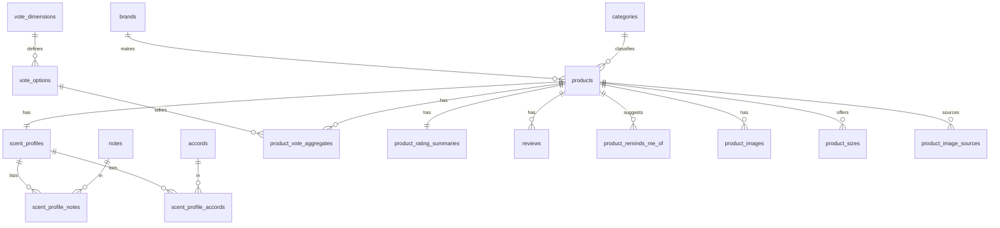

# Data Model

Luminascent stores product catalog data in **Cloudflare D1** (SQLite). Migrations live in `backend/migrations/`.

## Entity relationships



## Core entities

### `brands`

Maker/designer/house (Fragrantica "designer" maps here).

| Column | Type | Notes |
|--------|------|-------|
| id | TEXT PK | UUID |
| name | TEXT | |
| slug | TEXT UNIQUE | URL-safe identifier |
| country | TEXT | optional |
| website_url | TEXT | optional |

### `categories`

Product type: candle, perfume, wax_melt, room_spray, diffuser, incense.

| Column | Type |
|--------|------|
| id | TEXT PK |
| name | TEXT |
| slug | TEXT UNIQUE |

### `products`

The thing users search, review, and rate. Size-specific attributes (grams, price, burn time) live in `product_sizes`, not here.

| Column | Type | Notes |
|--------|------|-------|
| id | TEXT PK | |
| category_id | TEXT FK | → categories |
| brand_id | TEXT FK | → brands, optional |
| name, slug | TEXT | slug is unique |
| release_year | INTEGER | |
| description, image_url | TEXT | `image_url` is legacy/external; uploaded images use `product_images` |
| wax_type | TEXT | soy, paraffin, beeswax, vegetable wax, etc. (product-level) |
| vessel_material | TEXT | glass, ceramic, tin, metal, etc. (product-level) |
| is_discontinued | INTEGER | 0/1 |

### `product_sizes`

Normalized size/price variants for a single logical product (e.g. 200g and 500g of the same candle). This is the source of truth for grams, price, and burn time.

| Column | Type | Notes |
|--------|------|-------|
| id | TEXT PK | UUID |
| product_id | TEXT FK | → products, CASCADE delete |
| size_value | REAL | e.g. 200, 500 |
| size_unit | TEXT | g, oz, ml, kg |
| size_grams | INTEGER | normalized mass when unit is weight |
| price_amount | INTEGER | minor units (pence/cents), per size |
| price_currency | TEXT | |
| burn_time_hours | INTEGER | per-size burn time |
| sku | TEXT | optional retailer SKU |
| availability | TEXT | InStock, OutOfStock, etc. |
| source_url | TEXT | URL for this specific variant |
| position | INTEGER | display order |
| is_primary | INTEGER | 0/1 — default size for listings |

### `product_images`

Uploaded images stored in R2. See [Storage](./storage.md) for bucket and key layout.

| Column | Type | Notes |
|--------|------|-------|
| id | TEXT PK | UUID |
| product_id | TEXT FK | → products, CASCADE delete |
| r2_key | TEXT UNIQUE | e.g. `{product-id}/{rand6}.png` |
| position | INTEGER | Display order (0-based) |
| is_primary | INTEGER | 0/1 — primary image for listings |
| created_at | TEXT | |

Public URL is built at read time: `{R2_PUBLIC_BASE_URL}/{r2_key}`.

### `product_image_sources`

Staging table for scraped image URLs before R2 upload. The import service copies rows into `product_images` once uploaded to R2.

| Column | Type | Notes |
|--------|------|-------|
| id | TEXT PK | UUID |
| product_id | TEXT FK | → products, CASCADE delete |
| source_url | TEXT | original retailer image URL |
| position | INTEGER | display order |
| is_primary | INTEGER | 0/1 |
| r2_image_id | TEXT FK | → product_images, set after upload |

## Scent profile

Each product has one scent profile (may be reused across variants later).

### `scent_profiles`

| Column | Type |
|--------|------|
| id | TEXT PK |
| product_id | TEXT UNIQUE FK |
| summary | TEXT |

### `notes` + `scent_profile_notes`

Notes are normalized for fast filtering — not stored as JSON.

| `notes` | |
|---------|--|
| id, name, slug UNIQUE | |
| note_family | citrus, spice, woods, floral, gourmand, resin, etc. |

| `scent_profile_notes` | |
|-----------------------|--|
| scent_profile_id, note_id, pyramid_stage | PK composite |
| pyramid_stage | top, middle, base, general, unknown |
| position_index | ordering within stage |

### `accords` + `scent_profile_accords`

Main accords (woody, vanilla, smoky, etc.) as first-class filterable entities.

| `scent_profile_accords` | |
|-------------------------|--|
| strength_score | optional intensity 0–1 |
| position_index | display order |

## Community signals

### Vote dimensions (generic model)

Instead of separate tables per widget, one pattern covers all vote types:

**`vote_dimensions`** — rating_reaction, season, longevity, sillage, gender, price_value, time_of_day, occasion

**`vote_options`** — e.g. love/like/ok/dislike/hate, spring/summer/autumn/winter, intimate/moderate/strong/enormous

**`product_vote_aggregates`** — `(product_id, vote_option_id) → vote_count`

### `product_rating_summaries`

Numeric rating kept separate from reaction votes.

| Column | Type |
|--------|------|
| rating_avg | REAL |
| rating_count | INTEGER |

### `product_reminds_me_of`

Product-to-product similarity suggestions. Supports both linked products and external references not yet in the catalog.

| Column | Type |
|--------|------|
| reminded_product_id | TEXT FK, nullable |
| external_brand_name, external_product_name | for unimported targets |
| thumbs_up, thumbs_down | |

### `reviews`

| Column | Type |
|--------|------|
| author_name | TEXT (user_id deferred) |
| rating, title, body | |
| helpful_count, unhelpful_count | |
| published_at | |

## Full-text search

**`product_search`** — FTS5 virtual table, denormalized text:

- product name, brand name, description
- all note names, all accord names
- review snippets

Rebuilt by `rebuildProductSearch()` whenever a product or its facets change.

Structured filters (category, notes, accords, votes, min rating) use normal SQL JOINs, not FTS.

## Example faceted queries

**Candles rated 4+ with flour as a note:**

```sql
SELECT DISTINCT p.*
FROM products p
JOIN categories c ON c.id = p.category_id
JOIN product_rating_summaries prs ON prs.product_id = p.id
JOIN scent_profiles sp ON sp.product_id = p.id
JOIN scent_profile_notes spn ON spn.scent_profile_id = sp.id
JOIN notes n ON n.id = spn.note_id
WHERE c.slug = 'candle'
  AND prs.rating_avg >= 4
  AND n.slug = 'flour';
```

**Woody candles, good for winter, strong sillage:**

```sql
SELECT DISTINCT p.*
FROM products p
JOIN categories c ON c.id = p.category_id
JOIN scent_profiles sp ON sp.product_id = p.id
JOIN scent_profile_accords spa ON spa.scent_profile_id = sp.id
JOIN accords a ON a.id = spa.accord_id
JOIN product_vote_aggregates winter_votes ON winter_votes.product_id = p.id
JOIN vote_options winter_option ON winter_option.id = winter_votes.vote_option_id
JOIN product_vote_aggregates sillage_votes ON sillage_votes.product_id = p.id
JOIN vote_options sillage_option ON sillage_option.id = sillage_votes.vote_option_id
WHERE c.slug = 'candle'
  AND a.slug = 'woody'
  AND winter_option.slug = 'winter'
  AND winter_votes.vote_count > 0
  AND sillage_option.slug IN ('strong', 'enormous')
  AND sillage_votes.vote_count > 0;
```

## Seed data

Migration `0002_seed_reference.sql` seeds categories, vote dimensions/options, accords, notes, brands, and two sample candles. Migration `0006_product_size_fields.sql` backfills their size/price/burn data into `product_sizes` and removes the legacy columns from `products`.

## Scraping output → import

The crawler at `scrapling/crawler/` produces per-brand `products.json` shaped for import. Each product record includes:

- `sizes[]` — per-variant grams, price, burn time, SKU, availability (no flat product-level size/price fields)
- `images[]` — `{ source_url, position, is_primary }`
- `notes[]`, `accords[]` — with slugs for reference data
- `wax_type`, `vessel_material`, `description`, `scent_summary` — product-level

The admin import page (`/import`) or `POST /admin/import/product` writes these into D1. Resume/failure state for crawls lives in local files (`state.json`, `failures.jsonl`), not in D1.

See [scrapling/crawler/README.md](../scrapling/crawler/README.md) for the full pipeline.

## Explicitly excluded (for now)

No D1 scrape-tracking layer:

- `scrape_runs`, `scraped_pages`, `scrape_anomalies`
- `product_source_snapshots`
- `source_*` columns on products/reviews
