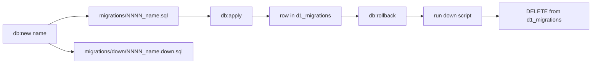

# Migrations

Luminascent uses **Wrangler's native D1 migrations** with a paired down-script convention for rollback. Migration files live in `backend/migrations/`.

D1 only supports forward migration natively. Rollback is handled by our own scripts running the matching `down/` SQL and removing the row from `d1_migrations`.

## Layout

```
backend/migrations/
  0001_init.sql              # forward (Wrangler applies these)
  0002_seed_reference.sql
  ...
  down/
    0001_init.down.sql       # reverse (Wrangler ignores this folder)
    0002_seed_reference.down.sql
    ...
```

Wrangler tracks applied migrations in the `d1_migrations` table.

## Commands

Run from `backend/`:

| Command | Purpose |
|---------|---------|
| `npm run db:new -- <name>` | Create up + down migration pair |
| `npm run db:status` | List migration status (local) |
| `npm run db:status:remote` | List migration status (remote) |
| `npm run db:apply` | Apply pending migrations locally |
| `npm run db:apply:remote` | Apply to production |
| `npm run db:rollback` | Roll back last migration locally |
| `npm run db:rollback:remote -- --yes` | Roll back remotely (requires `--yes`) |
| `npm run db:reset` | Wipe local D1 state and re-apply all |

## Workflow



### Create a migration

```bash
cd backend
npm run db:new -- add_product_tags
```

Edit both the up and down files. Every up migration must have a matching down script.

### Apply

```bash
npm run db:apply          # local
npm run db:apply:remote   # production
```

### Roll back

```bash
npm run db:rollback
```

Steps performed by `scripts/rollback.mjs`:

1. Query `d1_migrations` for the last applied migration
2. Execute the matching `migrations/down/*.down.sql`
3. Delete that row from `d1_migrations`

Remote rollback requires explicit confirmation:

```bash
npm run db:rollback:remote -- --yes
```

## Current migrations

| Migration | Purpose |
|-----------|---------|
| `0001_init.sql` | All core tables, indexes, FTS5 `product_search` |
| `0002_seed_reference.sql` | Categories, vote dimensions/options, accords, notes, sample products |
| `0003_product_images.sql` | `product_images` table for R2-backed uploads |
| `0004_product_sizes.sql` | `product_sizes` table for multi-variant products |
| `0005_product_image_sources.sql` | `product_image_sources` staging for scraped URLs |
| `0006_product_size_fields.sql` | Add `burn_time_hours` to `product_sizes`; backfill from products; drop legacy size/price columns from `products` |

## Production setup

The remote D1 database is configured in `backend/wrangler.jsonc`:

```json
"d1_databases": [{
  "binding": "DB",
  "database_name": "luminascent",
  "database_id": "<your-id>",
  "migrations_dir": "migrations"
}]
```

First-time remote setup:

```bash
wrangler d1 create luminascent   # if not already created
# copy database_id into wrangler.jsonc
npm run db:apply:remote
```

## Emergency recovery

For a bad migration on production, use D1 Time Travel (restores entire DB to a point in time, up to 30 days):

```bash
wrangler d1 time-travel info luminascent
wrangler d1 time-travel restore luminascent --timestamp=<unix_timestamp>
```

Use for emergencies, not routine rollbacks.

## Testing

Vitest uses an isolated D1 instance. Tests apply all migrations in order via `test/applyMigrations.ts`, which loads SQL from `test/schema-sql.ts` (regenerated from the migration files).

Regenerate after adding migrations:

```bash
cd backend
node -e "
const fs = require('fs');
const path = require('path');
const dir = 'migrations';
const files = fs.readdirSync(dir).filter(f => f.endsWith('.sql')).sort();
const all = files.map(f => fs.readFileSync(path.join(dir, f), 'utf8').trim()).join('\\n\\n');
fs.writeFileSync('test/schema-sql.ts', 'export const MIGRATION_SQL = ' + JSON.stringify(all) + ';\\n');
"
npm test
```
