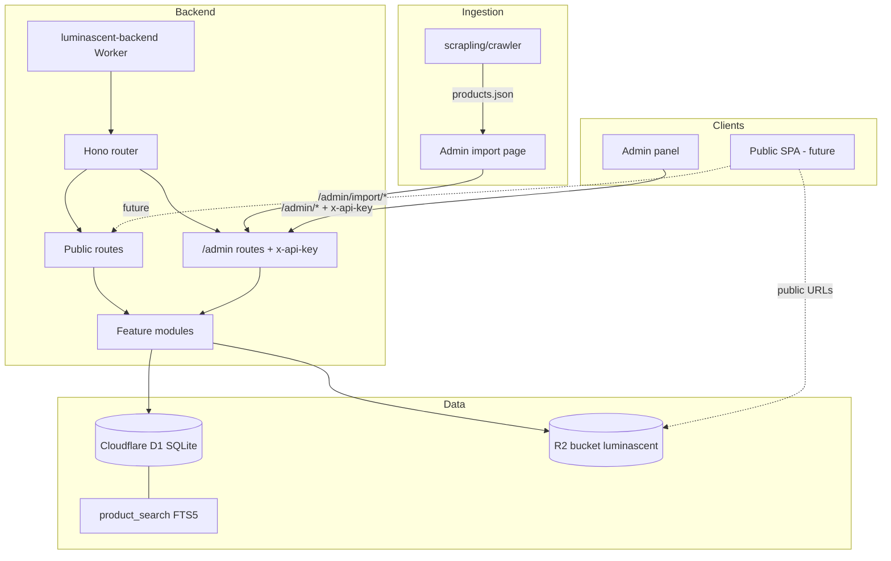

# Overview

Luminascent is a candle database and discovery platform — think [Fragrantica](https://www.fragrantica.com/) for candles. Users browse, search, and compare candles by brand, scent profile, notes, accords, and community signals.

The schema is designed to start with candles but extend to perfumes, wax melts, room sprays, diffusers, and other scent products without rebuilding the database.

## Current status

| Area | Status |
|------|--------|
| D1 schema | Done — 19 tables + FTS5 search index |
| Seed data | Done — categories, vote dimensions, accords, notes, 2 sample candles |
| Migration tooling | Done — forward migrations + paired down scripts + npm commands |
| Backend API | Done — Hono on Cloudflare Workers, read + write endpoints |
| Admin API (`/admin`) | Done — mirror routes behind `x-api-key` middleware + CORS |
| Product images (R2) | Done — upload to `luminascent` bucket, `product_images` table |
| Product sizes | Done — `product_sizes` table; grams, price, burn time per variant |
| Bulk import API | Done — `/admin/import/brand` and `/admin/import/product` |
| Scraping pipeline | Done — `scrapling/crawler/` produces import-ready JSON |
| Tests | Done — faceted search, FTS, nested product GET with sizes |
| Admin panel | Done — entity CRUD, product create/edit/delete, sizes editor, import UI |
| Public frontend | Not started — still the Cloudflare/Vite starter template |
| Auth / users | Partial — temporary API key for admin; no user accounts |
| Raw HTML/JSON archive in R2 | Not implemented — crawl HTML stored locally in pass folders |

## Architecture



**Stack**

| Package | Stack | Deploy target |
|---------|-------|---------------|
| `backend` | TypeScript, Hono, Zod, Wrangler, Vitest | Cloudflare Worker |
| `luminascent-admin-panel` | React 19, Vite, shadcn/ui, TanStack Query | Cloudflare Pages |
| `frontend` | React 19, Vite, TypeScript | Cloudflare Pages |
| `scrapling/crawler` | Python, Scrapling, Ollama | Local (not deployed) |

**Bindings**

- `DB` — D1 database `luminascent` (see `backend/wrangler.jsonc`)
- `BUCKET` — R2 bucket `luminascent` for product images (see [Storage](./storage.md))
- `ADMIN_API_KEY` — env var for admin route auth (see `backend/wrangler.jsonc` vars)
- `R2_PUBLIC_BASE_URL` — public base URL for image URLs (no trailing slash)

## Repo layout

```
luminascent/
├── docs/                      # Project documentation (this folder)
├── backend/                   # Cloudflare Worker API
├── luminascent-admin-panel/   # Admin SPA
├── frontend/                  # Public site (starter template)
└── scrapling/crawler/         # Candle scraping pipeline → products.json
```

## Backend structure

Routes are declared in `backend/src/index.ts`. Handlers, repos, schemas, and types live in feature folders:

```
backend/
├── migrations/           # D1 SQL migrations + down/ rollback scripts
├── scripts/              # new-migration.mjs, rollback.mjs
├── src/
│   ├── index.ts          # Hono app, public + /admin route mounting, CORS
│   ├── lib/              # db helpers, id, slugify, http errors, apiKeyAuth
│   └── features/
│       ├── products/     # list, search, get, create, update, delete, FTS
│       ├── sizes/        # product_sizes read/write
│       ├── images/       # product image upload/list/delete (R2)
│       ├── import/       # scraped JSON → D1 import
│       ├── brands/
│       ├── categories/
│       ├── notes/
│       ├── accords/
│       ├── votes/
│       ├── reviews/
│       └── reminds/
└── test/                 # Vitest + Workers pool
```

## Design principles

1. **Relational tables for anything users filter on** — notes, accords, vote dimensions, ratings are normalized, not JSON blobs.
2. **Fragrantica mental model** — scent pyramids, note families, accords, vote widgets (season, sillage, gender, etc.), reminds-me-of, reviews.
3. **Category as product type** — `products.category_id` points at candle, perfume, wax_melt, etc. Same schema, different category.
4. **Brand = designer/house** — Fragrantica's "designer" maps to `brands`. Perfumers/creators can be added later as a separate table.
5. **Generic vote model** — one `vote_dimensions` + `vote_options` + `product_vote_aggregates` pattern instead of a new table per widget.
6. **FTS for text, SQL for facets** — `product_search` (FTS5) handles free-text; structured filters use JOINs on relational tables.
7. **Size variants are first-class** — grams, price, burn time, SKU, and availability live in `product_sizes`, not on the product row.

## Admin panel

See [Admin panel](./admin-panel.md) for full details. Summary:

- Left nav with env selector (Local / Dev / Prod)
- Entity list + create for brands, categories, notes, accords
- Product list with filters, create dialog, edit page, bulk delete
- Multi-size editor per product (grams, price, burn time, SKU, etc.)
- Import page — upload `products.json` from the crawler and import into D1

See [Storage](./storage.md) for R2 bucket and upload flow details.

## Scraping pipeline

The Python crawler at `scrapling/crawler/` crawls retailer category pages, extracts structured candle data (including multi-size variants), and writes `products.json` per brand. The admin import page sends those records to `/admin/import/product`.

Full command reference: [scrapling/crawler/README.md](../scrapling/crawler/README.md).

Per-site overrides (e.g. Acqua di Parma variant swatches) go in `scrapling/crawler/sites.local.json` (copy from `sites.local.json.example`).

## What's not built yet

- User accounts and proper auth (admin uses temporary API key)
- Raw HTML/JSON archive in R2 (crawl HTML is local under `output/<brand>/passes/`)
- Recommendation engine (schema supports note/accord overlap; Vectorize/embeddings not wired)
- Public frontend pages consuming the API
- Admin: rating/votes/reviews/reminds management UI
- Orphan R2 object garbage collection for abandoned draft uploads

## Open questions

- Auth provider (Clerk, Auth0, Cloudflare Access, roll-your-own)
- Note ontology source (curated list vs free-form tags)
- Image moderation and who can add new entries
- Similarity algorithm (note overlap, embeddings via Vectorize, or hybrid)
